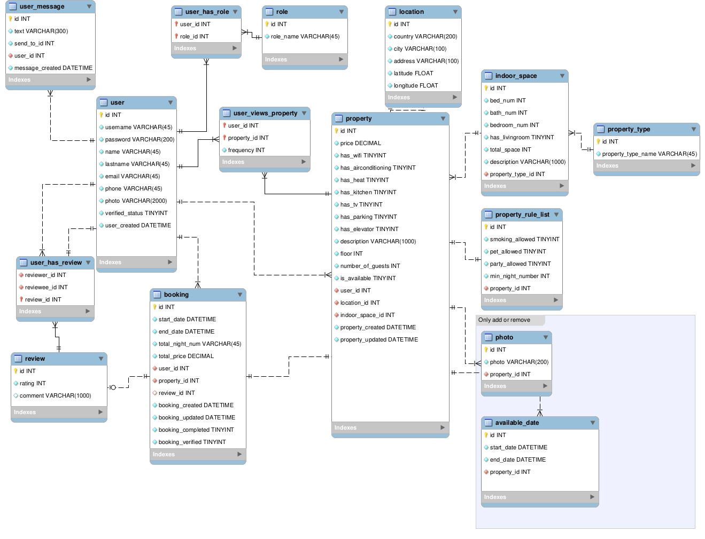
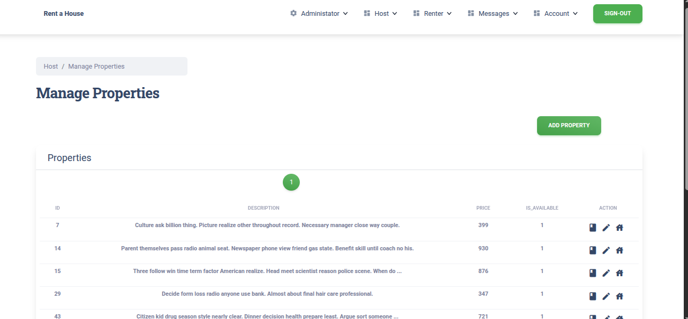
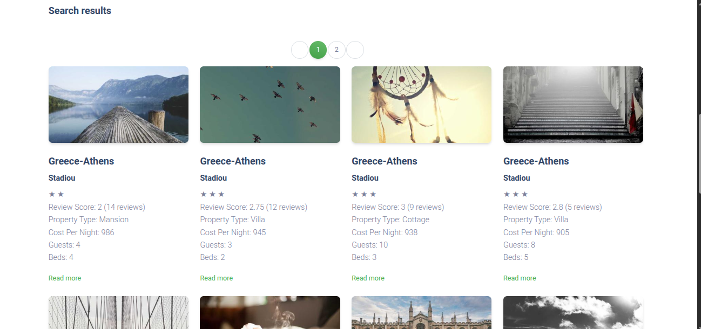
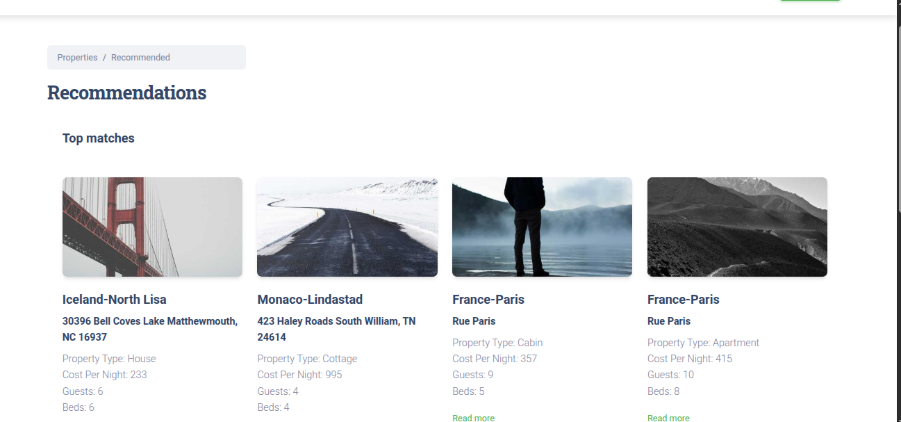

# Rent-a-House - A Web Application for Property Rentals
## Overview

This project implements a full-stack web application for property rentals, inspired by modern accommodation platforms. The system enables users to act as hosts or renters, supporting property management, booking workflows, secure authentication, messaging, and personalized recommendations.

The application is structured as a three-tier system:

- A relational database for data persistence

- A RESTful backend API handling business logic and security

- A frontend application for user interaction

Special emphasis was placed on database schema design, layered backend architecture, role-based authorization, and controlled API data exposure.

The platform supports three user roles: administrator, host, and renter, each with clearly defined permissions.

## Database Design
The relational schema was designed in MySQL Workbench and implemented in MySQL. Core entities include:

- Users and roles

- Properties

- Bookings

- Ratings

- Messages

- Property views

  


Role-based access control is enforced at the application level. Referential integrity is maintained through primary and foreign keys, and normalization principles were applied to minimize redundancy. Strategic indexing supports efficient query execution.

Database interaction is handled through SQLAlchemy ORM, mapping relational tables to Python classes and enabling structured query generation.

## Backend Implementation
The backend was implemented using FastAPI and follows a layered architectural approach to ensure separation of concerns.

The main layers include:

- Routing layer (HTTP request handling)

- Controller layer (business logic)

- Model layer (database interaction via SQLAlchemy)

Authentication is implemented using JWT-based token validation. Protected endpoints enforce both authentication and role-based authorization.

Pydantic schemas are used to validate and serialize responses, preventing uncontrolled exposure of database objects.

The API supports CRUD operations, property search, booking management, messaging, and administrative data export.

## Authentication and Authorization
Authentication is implemented using JSON Web Tokens (JWT). Upon successful login, a token is generated and returned to the user. This token must be included in subsequent requests to protected endpoints.

Each protected request undergoes token validation to verify authenticity and expiration. Unauthorized access results in an HTTP 401 response. In addition to authentication, role-based authorization is enforced to restrict access depending on whether the user acts as an administrator, host, or renter.

This mechanism ensures that sensitive operations, such as user management or data export, are accessible only to authorized roles.


  


## Frontend Implementation

The frontend was developed using Vue.js 3 with the Composition API. State management is handled using Pinia to centralize authentication state and user data.

The interface adapts dynamically based on user roles:

- Hosts can manage property listings and review booking requests.

- Renters can search properties, submit booking requests, and manage reservations.

- Administrators have extended management capabilities.

   
        
The frontend communicates exclusively with the backend through structured API calls, maintaining a clean separation between presentation and business logic

## Recommendation System
The platform incorporates a personalized recommendation system based on collaborative filtering using matrix factorization.

A sparse user–property rating matrix is constructed from explicit ratings. Matrix factorization is applied to approximate missing values and generate predicted preferences for unseen properties.

Model parameters are optimized using gradient descent to minimize reconstruction error. Additionally, implicit feedback (property view frequency) is incorporated to enhance personalization.

This component integrates concepts from linear algebra and numerical optimization into the backend workflow.

 

## Running the Application

### Backend

```
cd backend
pip install -r requirements.txt
cp .env.example .env
uvicorn main:app --reload
```
Configure database credentials inside .env before running.

### Frontend
```
cd frontend
npm install
npm run dev
```
The frontend connects to the backend running locally.
